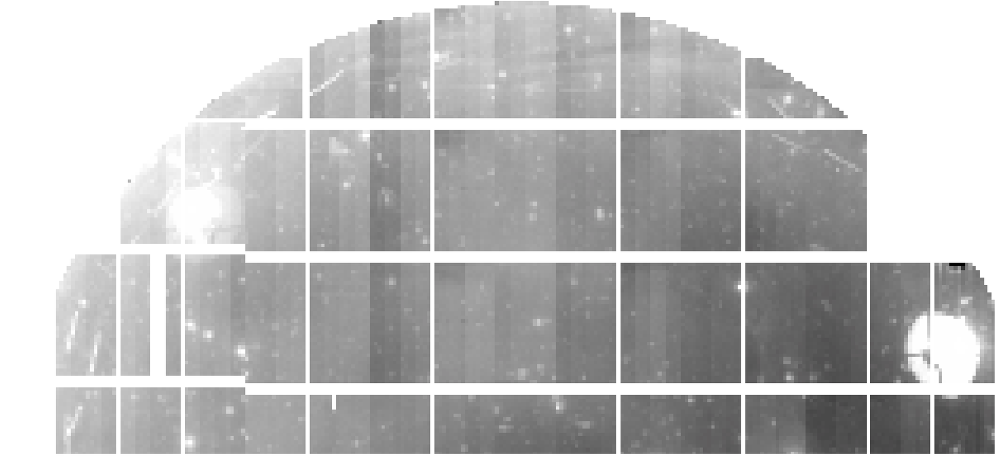

# Amp-to-Amp Offsets

Visible jumps in the pedestal level between amps is evident in the HSC processed data. The cause of such a jump remains unclear. The image below (created by Yusra AlSayyad) shows the median binned (128x128) HSC-I visit 1252 PDR1-WIDE focal plane, with obvious amp jumps evident here.

In the sections below we explore this offset in greater detail, attempting to understand it, and/or derive a prescription to mitigate it.

## deltaoverscan

A recreation of Eli's initial code, attempting to use the raw horizontal overscan region to attempt to predict the amp jump in a meaningful way. 

