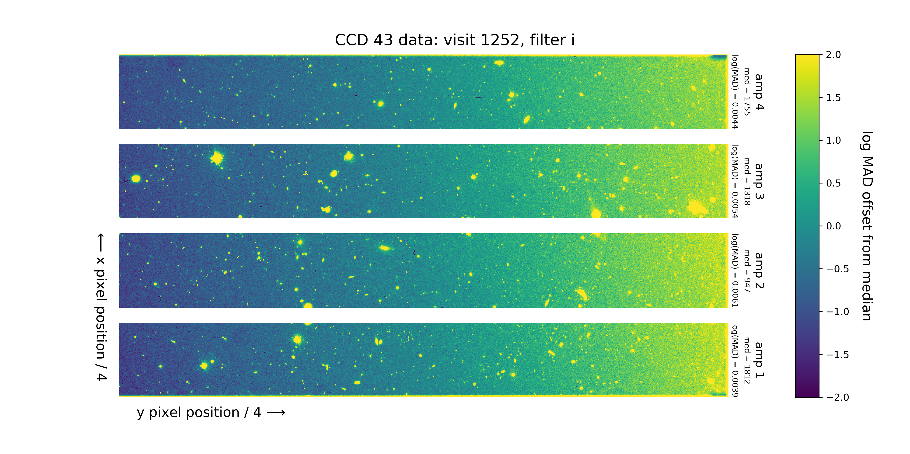
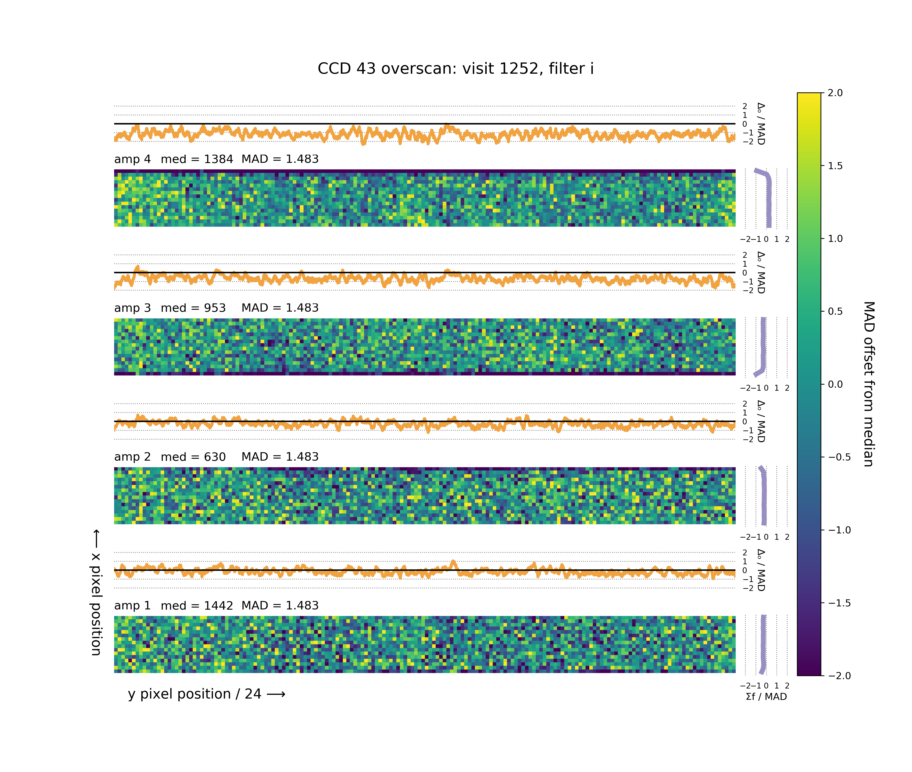
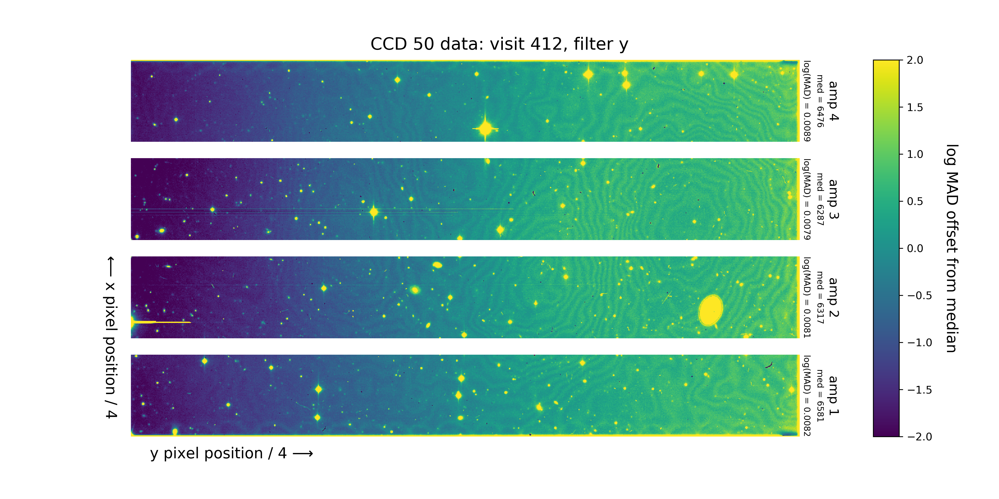
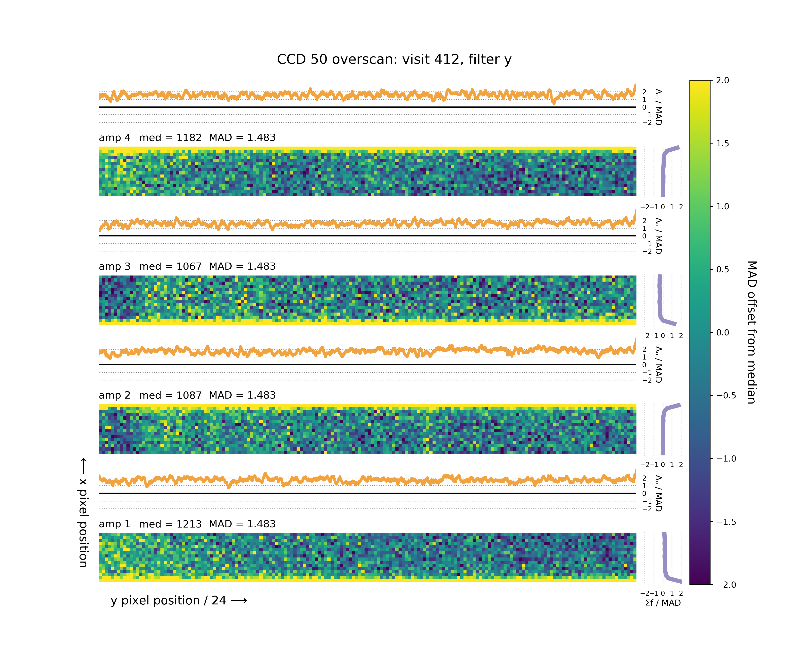

# Amp-to-Amp Offsets and CCD Plots

Here we generate plots of a given CCD spanning multiple visits, to look for possible CCD-specific effects.

For each visit, we generate a mock up of the data bounding box and the overscan bounding box. Pixel data is binned as indicated.

## CCD 43, Visit 1252: Data

## CCD 43, Visit 1252: Overscan

## CCD 50, Visit 1252: Data

## CCD 50, Visit 412: Overscan

