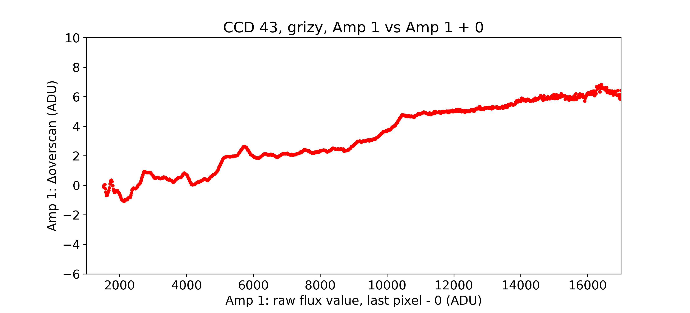
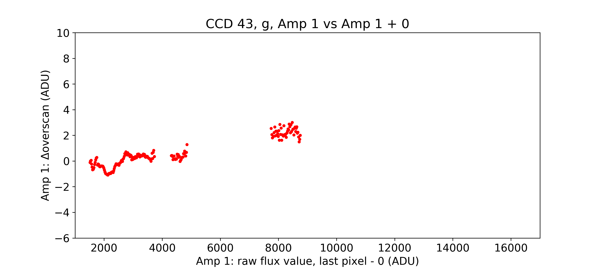
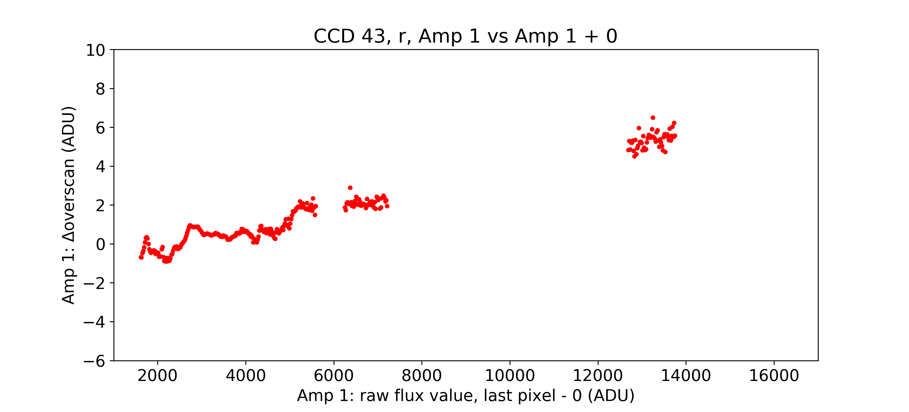
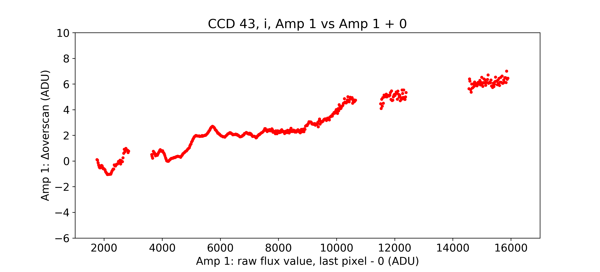
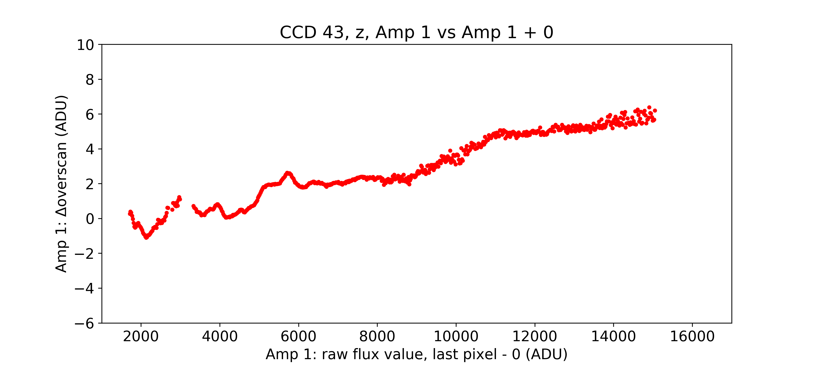
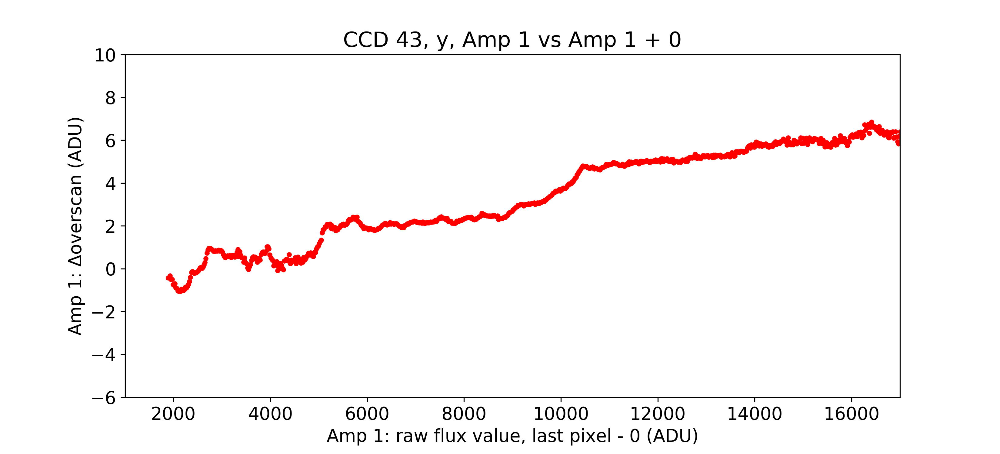

# Amp-to-Amp Offsets and the Delta Overscan

Here we look at the relation between the Delta Overscan (the median difference between the first and last column in the raw horizontal overscan region) and the raw flux value in the data pixel immediately bounding the overscan region. These figures are a re-creation of those initially constructed by Eli Rykoff during his exploratory work on this issue. 

Within this notebook we generate plots in this parameter space. We analyse the delta overscan as a function of passband, amp X vs amp Y (i.e., not only amp X vs amp X axes), and varying the column distance offset from the edge of the data bounding box. 

In brief, we find that the shape of the delta overscan profile appears static when keeping the x-axis raw flux value fixed to a particular amp. The choice of amp appears arbitrary, however, the magnitude of the shape fluctuation appears to increase moving from amp 1 to amp 4. 

The shape of the delta overscan offset appears unaffected by passband. Similarly, the choice of data column offset does not appear to significantly impact these results. 

The cause of this amp jump phenomena remains a mystery, necessitating further exploration of other approaches towards resolving this, including perhaps a simple per-amp background subtraction, or amp-jump minimisation fitting.

## CCD 43: Amp 1 vs Amp 1 grizy

## CCD 43: Amp 1 vs Amp 1 g

## CCD 43: Amp 1 vs Amp 1 r

## CCD 43: Amp 1 vs Amp 1 i

## CCD 43: Amp 1 vs Amp 1 z

## CCD 43: Amp 1 vs Amp 1 y

